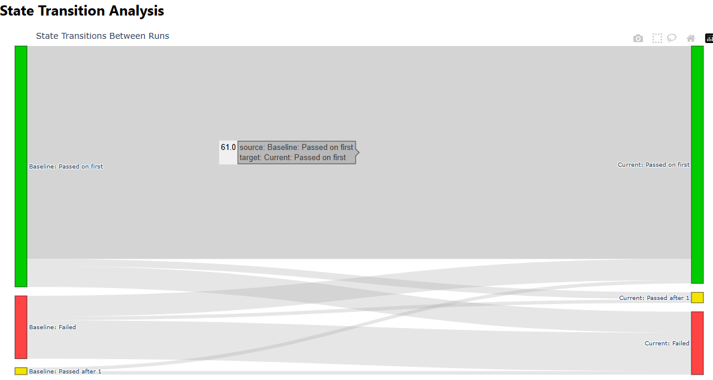
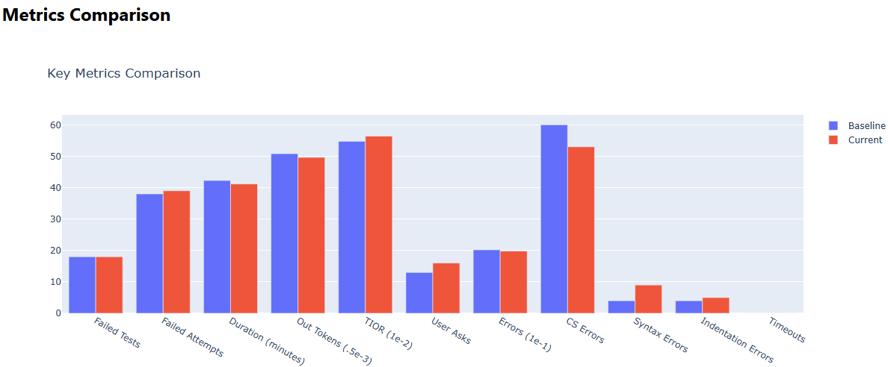
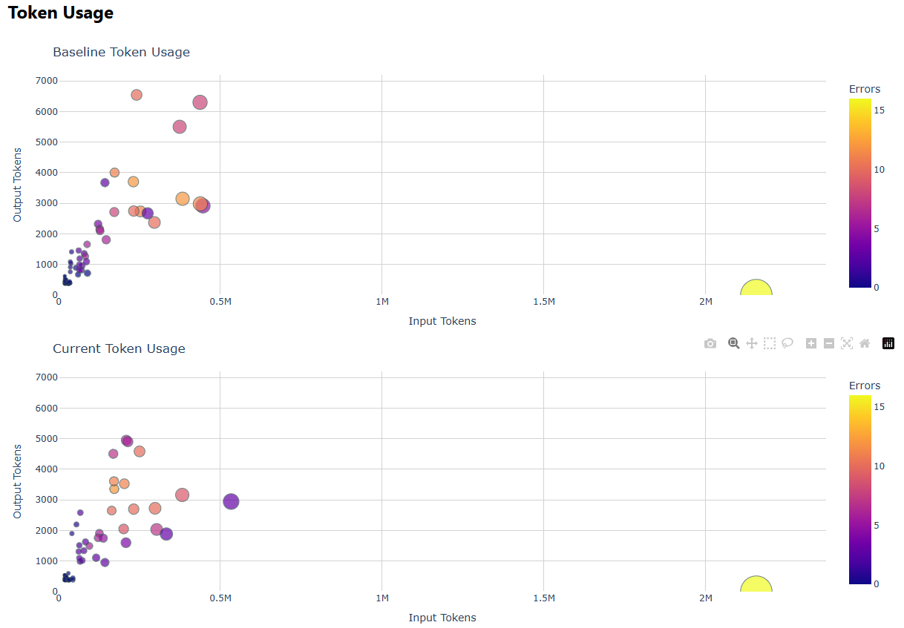
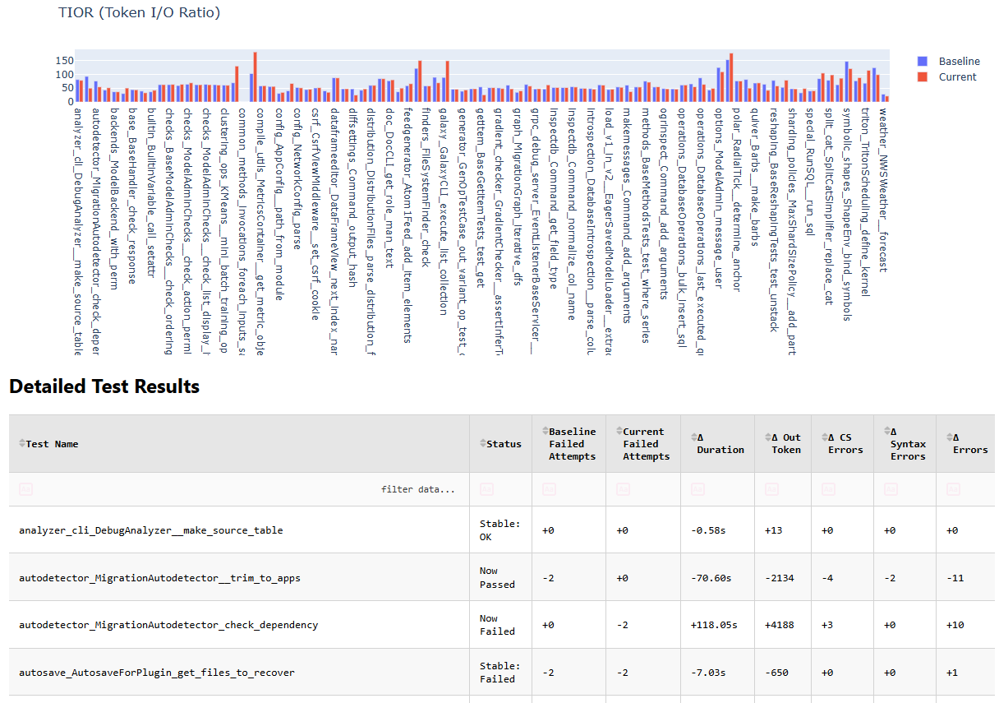

# BDA - Benchmark Delta Analysis Tool

A Python tool for analyzing and visualizing differences between two Aider benchmark runs through an interactive dashboard.

[](https://pypi.org/project/cedarverse-bda)
[](https://pypi.org/project/cedarverse-bda/)
[](https://github.com/psf/black)
[](https://opensource.org/licenses/Apache-2.0)

## Features

- Compares two benchmark run folders (raw or tar-bz2 archives)
- Interactive web dashboard built with Dash
- Detailed test-by-test comparison analysis
- Visualizes performance changes and differences

## Dashboard Features
- Test result comparison
- Performance metrics visualization
- Interactive data filtering and sorting
- Detailed test case analysis









## Installation

```bash
pipx install cedarverse-bda
```

## Usage

```bash
# Info on a single benchmark run
bda <run-path>

# Delta Analysis
bda <run1-path> <run2-path>

# Interactive dashboard
bda --dashboard <run-path>

```

## Development


```bash
# Install development dependencies
pip install -e .[dev]
```
